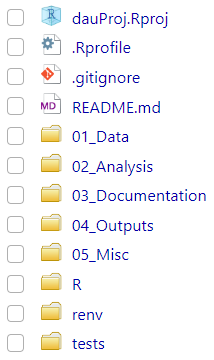
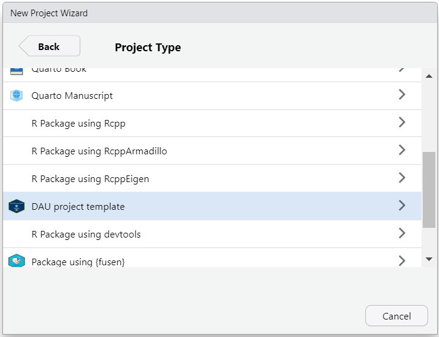

# dauRtemplate 

- The RStudio projects of your colleagues all have a different structure? 

- It is  difficult to navigate and understand others' projects?

- Or even your own project from a few months/years ago? 

If so... it may be useful if you all agreed on a standard folder structure for
your analysis.
Templates can help to enforce this. 

This package provides one standard project folder structure template for 
R projects geared towards DAU analysis use cases.
Whenever you start a new project in RStudio, this package provides the standard
folder structure directly in your code editor.
Also, it can help you improving reproducibility by using git and `renv`.



<br>

## Installation

``` r
remotes::install_github("JT-39/dauRtemplate")
```

## Usage

To create a new project with the folder structure shown below, follow these 
steps:

1.  Install the package
2.  Restart RStudio
3.  When creating a new RStudio project with the "New directory" option,
choose "DAU project template"



<br>    

4.  During initialization you can select if you want to include a package 
structure (check "Include folders and files required to build a R package 
(recommended).")
5.  You can select if you want to generate a GitHub suitable `.gitignore` file
(check "Create a .gitignore file for GitHub")
7.  Once you've created the project, you will be provided with the instructions 
how to create a git repository for your project and connect to GitHub/Azure
DevOps.

## Template overview

A new project contains the following folder structure:

```
|-- 01_Data
|   |-- 01_Raw
|   `-- 02_Clean
|-- R
|   |-- load_data.R
|   |-- helpers.R
|   |-- src
|-- tests
|   |-- testthat.R
|   |-- testthat
|   |   |-- test-load_data.R
|   |   |-- test-helpers.R
|-- 02_Analysis
|   |-- analysis.Rmd
|   |-- analysis.qmd
|-- 03_Documentation
|   |-- 01_text
|   `-- 02_figures
|-- 04_Outputs
|   |-- 01_results              
|   |-- 02_figures              
|   `-- 03_tables    
|-- 05_Misc
|   |-- 01_public              
|   |-- 02_priv
|-- README.md
|-- proj_name.Rproj
|-- .gitignore
|-- .Rprofile
|-- renv                        
```

## Planned features

- Fix issue where selecting open in a new session still opens project in the
current session.
- Add a ad-hoc project folder structure for very small projects
(no formal documentation, and more, needed).
- Collaboration with DAU team to agree on folder and file structure.
- Explain why this folder structure differs to template suggested.
- Further testing and documentation of the package.
- More support for a package folder structure.
- Integration with QA (automated QA document).
- Support for Shiny apps.


## Acknowledgements

This repository is very much built on the repository 
<a href="https://github.com/jonas-hag/analysistemplates"
target="_blank">analysistemplates</a>
by jonas-hag (Jonas Hagenberg).

They should take all the credit for producing the core infrastructure of this
package.